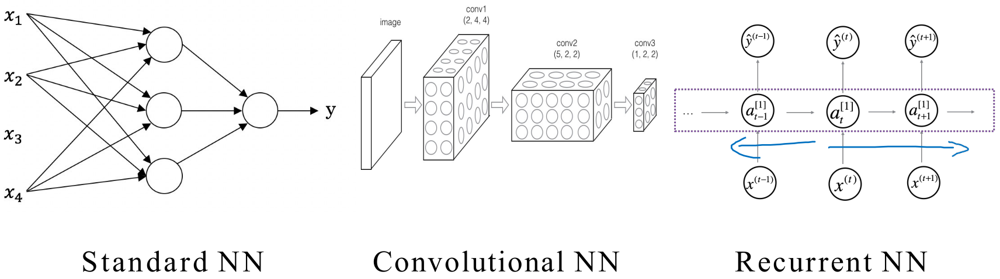
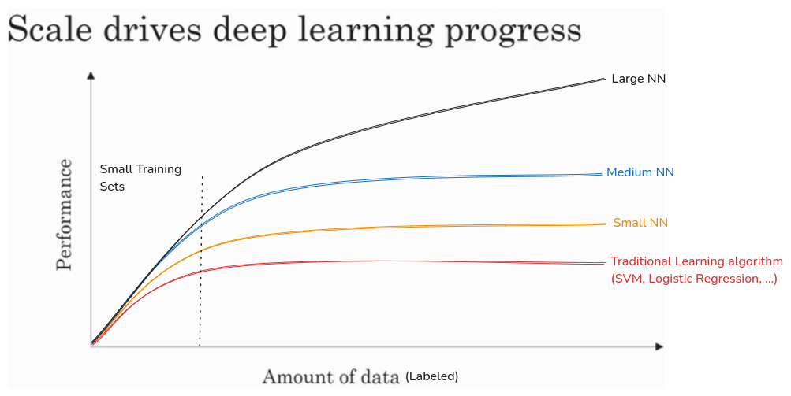

# Introduction to Deep Learning
**Deep Learning's Impact:**
- Deep learning is revolutionizing various industries, including healthcare, education, agriculture, and transportation (e.g., self-driving cars).
- It's compared to the "new electricity," similar to how electrification transformed society.

**Course Overview:**
- The specialization consists of five courses designed to equip learners with practical deep learning skills.
- **Course 1:** Foundations of neural networks and deep learning, including building a cat recognizer.
- **Course 2:** Practical aspects of deep learning, such as hyperparameter tuning and optimization.
- **Course 3:** Structuring machine learning projects, focusing on best practices in the deep learning era.
- **Course 4:** Convolutional neural networks (CNNs) for image processing.
- **Course 5:** Sequence models (RNNs, LSTMs) for natural language processing and other sequential data.

**Learning Outcomes:**
- Learners will gain the ability to build and train deep neural networks.
- They will learn to optimize and troubleshoot deep learning models.
- They will understand how to structure machine learning projects effectively.
- They will be able to apply CNN's and RNN's to real world problems.

**Goal:**
- To empower learners to contribute to the development of an AI-powered society.
- To give the student the skills to confidently add deep learning to their resume.

### What is a Neural Network?
**Neural Networks Basics:**

- Deep learning involves training neural networks, which can be very large.
- A neural network is a function that maps inputs to outputs.
- A simple neural network can be visualized as a single neuron that takes an input (e.g., house size) and produces an output (e.g., house price).
- This single neuron implements a function, such as a **ReLU** (Rectified Linear Unit) function, which introduces non-linearity.

**Building Larger Networks:**

- Larger neural networks are created by stacking multiple neurons together.
- These neurons can process multiple input features (e.g., size, bedrooms, zip code, wealth).
- Intermediate layers of neurons, called hidden units, learn complex relationships between the input features.
- Each hidden unit can take all input features as input, allowing the network to decide what each unit represents.
- The layers are described as "densely connected" because each input is connected to each hidden unit.

**Supervised Learning:**

- Neural networks excel at supervised learning, where the goal is to learn a mapping from inputs (x) to outputs (y) using labeled training data.
- The network learns to automatically discover the underlying patterns and relationships in the data.
- The network is given the inputs and the desired outputs, and the network adjusts its internal parameters to best match the desired output.
- The power of neural networks is that with enough data, they can learn very complex relationships.

### Supervised Learning with Neural Networks
**Supervised Learning Dominance:**

- Most of the economic value generated by neural networks stems from supervised learning.
- Supervised learning involves training a model to map inputs (x) to outputs (y) using labeled data.

**Key Applications:**
- **Online Advertising:** Predicting ad click-through rates, a highly lucrative application.  
- **Computer Vision:** Image recognition and tagging.  
- **Speech Recognition:** Transcribing audio to text.  
- **Machine Translation:** Translating text between languages.  
- **Autonomous Driving:** Object detection and scene understanding.

**Neural Network Architectures:**

- Different architectures are suited for different data types:
    - Standard neural networks for structured data (e.g., real estate, advertising).
    - Convolutional Neural Networks (CNNs) for image data.
    - Recurrent Neural Networks (RNNs) for sequential data (e.g., audio, language).

**Structured vs. Unstructured Data:**

- **Structured data:** Organized data with well-defined features (e.g., databases).
- **Unstructured data:** Raw data like audio, images, and text.
- Neural networks have significantly improved computers' ability to process unstructured data.
- Although unstructured data applications are more publicized, structured data applications generate much economic value.

**Economic Impact:**

- Neural networks are creating vast economic value across various sectors.
- This includes improved advertising systems, recommendation engines, and data processing capabilities.

**Recent Rise:**

- While the underlying concepts have existed for decades, recent advancements in computing power and data availability have fueled the surge in neural network applications.
### Why is Deep Learning taking Off?

**Data Availability:**

- The digitization of society has led to an explosion of data, exceeding the capabilities of traditional machine learning algorithms.
- Neural networks thrive on large datasets, with performance improving as data volume increases.
- The growth of labeled data, where inputs (x) and outputs (y) are both available, is crucial.

**Computational Power:**
- Training large neural networks requires significant computational resources.  
- Advances in hardware, such as GPUs, have enabled the training of much larger and more complex models.  
- "Scale" is a driving force, referring to both the size of neural networks and the amount of data.

**Algorithmic Innovations:**

- While scale is important, algorithmic improvements have also played a vital role.
- Innovations like the shift from sigmoid to ReLU activation functions have significantly accelerated training.  
- These algorithmic changes often focus on improving computational efficiency.
- The faster computation allows for faster experimentation and iteration, greatly improving research and development.

**Iterative Development:**
- Training neural networks is an iterative process of designing, implementing, and refining models.
- Faster computation speeds up this cycle, allowing for more experimentation and faster progress.
- The Deep Learning research community is constantly evolving and improving algorithms.

**Future Outlook:**

- The factors driving deep learning's success—data, computation, and algorithms—are expected to continue improving.
- This suggests that deep learning will continue to advance for years to come.

### Heroes of Deep Learning
**Guest:** Geoffrey Hinton

**Early Influences and Career Path:**

- Hinton's interest in the brain and memory began in high school, sparked by discussions about holograms.
- He pursued studies in physiology, physics, philosophy, and psychology, finding each lacking in explaining brain function.
- He eventually turned to AI, studying at Edinburgh, where he faced initial resistance to his focus on neural networks.
- A Sloan Fellowship took him to California, where he found a more receptive environment for neural network research.

**Key Contributions to Deep Learning:**

- **Backpropagation:**
    - While not the sole inventor, Hinton and his colleagues (David Rumelhart and Ron Williams) played a crucial role in popularizing the algorithm.  
    - Their 1986 Nature paper, aided by Hinton's strategic communication with reviewers, demonstrated backpropagation's ability to learn meaningful word representations.  
    - This work bridged the gap between feature-based and structured representations of knowledge.
- **Boltzmann Machines:**
	- Hinton considers his work on Boltzmann machines, particularly with Terry Sejnowski, to be his most elegant contribution.  
	- He highlighted the simple learning algorithm and its biological plausibility.
	- The development of Restricted Boltzmann Machines (RBMs) made these concepts practically applicable, contributing to the resurgence of deep learning.
- **Deep Belief Networks:**
	- Hinton's work on deep belief networks, including the use of RBMs for pre-training, provided an effective way to train deep neural networks.  
	- This allowed for efficient inference in sigmoid belief networks.
- **Variational Methods:**
    - He contributed to the development of variational methods, showing that approximate inference could significantly improve the efficiency of algorithms like EM.
    - He also published one of the first Variational Bayes papers.
- **ReLU Activation Functions:**
    - Hinton's group played a role in popularizing ReLU activations, demonstrating their equivalence to stacks of logistic units.
    - He also discovered the benefit of initializing networks with the identity matrix when using ReLUs.
- **Fast Weights:**
    - He has worked on fast weights, that adapt and decay rapidly, for modeling multiple time scales in deep learning. This allows for short term memory.  
- **Capsules:**
    - Hinton is currently focused on capsule networks, which he believes will significantly improve neural network generalization.  
    - Capsules represent multidimensional entities and enable "routing by agreement," a novel filtering mechanism.

**Insights and Current Research:**

- **Brain and Backpropagation:**
    - Hinton believes that the brain likely implements a form of backpropagation, despite skepticism from neuroscientists.  
    - He has explored alternative algorithms, such as recirculation, that could approximate backpropagation in biological systems.  
- **Multiple Time Scales:**
    - He is continuing to investigate how to model multiple time scales in deep learning, building on his early work with fast weights.
- **Capsules:**
    - He is passionate about capsule networks, which he believes offer a more structured and efficient approach to representation learning.
    - He believes that routing by agreement will be crucial for improving neural network generalization.

**Current Research and Perspectives:**

- **Capsule Networks:**
    - Hinton reiterates his strong belief in capsule networks and their potential to revolutionize image recognition and object representation.
    - He emphasizes "routing by agreement" as a key mechanism for improving generalization and handling viewpoint changes.
    - He is actively working on incorporating backpropagation into capsule network training.
- **Evolution of AI Understanding:**
    - Hinton discusses his shift from a focus on supervised learning in the mid-1980s to unsupervised learning in the early 1990s, and then back to supervised learning as it proved more effective in recent years.
    - He still firmly believes in the long-term importance of unsupervised learning.
    - He acknowledges the significance of Generative Adversarial Networks (GANs) as a major breakthrough.
- **Linearity and Representation:**
    - Hinton introduces a principle of transforming measurements into representations where actions become linear.
    - He illustrates this with the example of viewpoint changes, where coordinate representations allow for linear transformations.
- **Paradigm Shift in AI:**
    - Hinton argues for a paradigm shift from symbolic AI to a vector-based representation of thoughts.
    - He criticizes the idea that thoughts are symbolic expressions, comparing it to the notion that spatial understanding is based on pixels.
    - He believes that neural activity vectors are the true representation of thought.

**Advice for Aspiring Deep Learning Practitioners:**

- **Read Selectively and Trust Your Intuition:**
    - Hinton advises against excessive literature review, encouraging individuals to identify and challenge prevailing assumptions.
    - He emphasizes the importance of trusting one's intuition, even when faced with skepticism.
- **Programming Proficiency:**
    - He stresses the importance of continuous programming practice, highlighting its role in discovering crucial details and developing problem-solving skills.
- **Embrace Skepticism:**
    - He suggests that strong opposition to an idea can be a sign of its potential significance.
- **Seek Aligned Mentorship:**
    - He advises students to find advisors who share their research interests and beliefs.
- **PhD vs. Industry:**
    - He acknowledges the current shortage of deep learning faculty and the role of industry in training researchers.
    - He anticipates that universities will eventually adapt to the growing demand for deep learning education.

