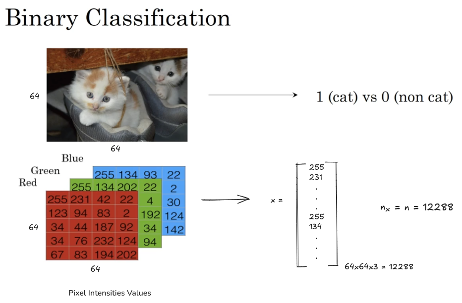

# Neural Network Basics
**Vectorization:**

- Neural network implementations aim to process the entire training set without explicit for-loops, using vectorization techniques.
- This significantly speeds up computation.

**Forward and Backward Propagation:**

- Neural network computations are organized into a forward pass (forward propagation) and a backward pass (backward propagation).
- Forward propagation calculates predictions, and backward propagation calculates gradients for parameter updates.

### Logistic Regression for Binary Classification

**Problem Setup:**
- Binary classification aims to categorize inputs (e.g., images) into two classes (e.g., cat or non-cat).  
- The output label (y) is either 0 or 1.

**Image Representation:**
- Images are stored as three matrices representing red, green, and blue color channels.  
- These matrices are "unrolled" into a single feature vector (x).  
- For a 64x64 pixel image, the feature vector has a dimension of 12,288 (64x64x3).
- nx represents the dimention of the input feature vector x.

**Notation:**
- (x, y): A single training example, where x is the feature vector and y is the label.
- m: The number of training examples.
- mtrain: alternative notation to represent the number of training examples.
- mtest: the number of test examples.
- X: A matrix formed by stacking the training example feature vectors (x1, x2, ..., xm) as columns.
    - Dimensions: nx by m.
    - `X.shape` in python returns (nx, m).
- `Y`: A matrix formed by stacking the training example labels (y1, y2, ..., ym) as columns.
    - Dimensions: 1 by m.
    - `Y.shape` in python returns (1, m).

